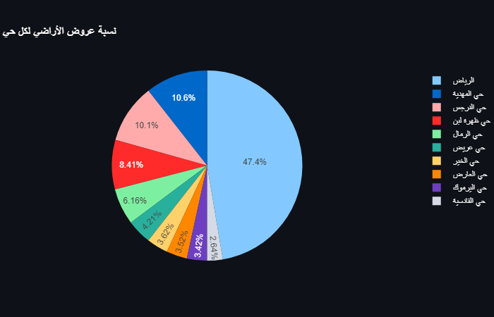
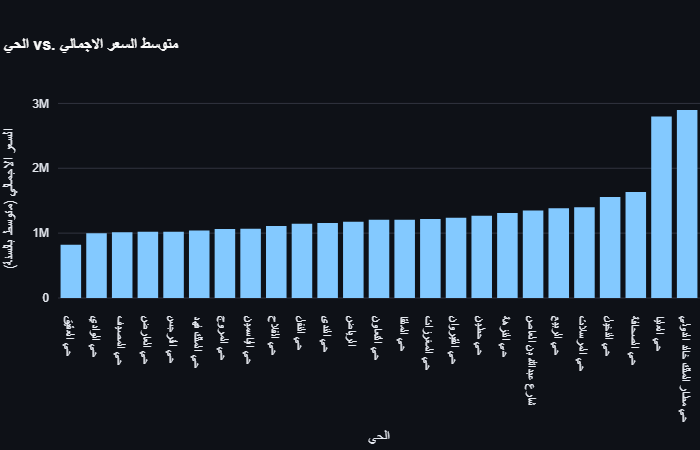
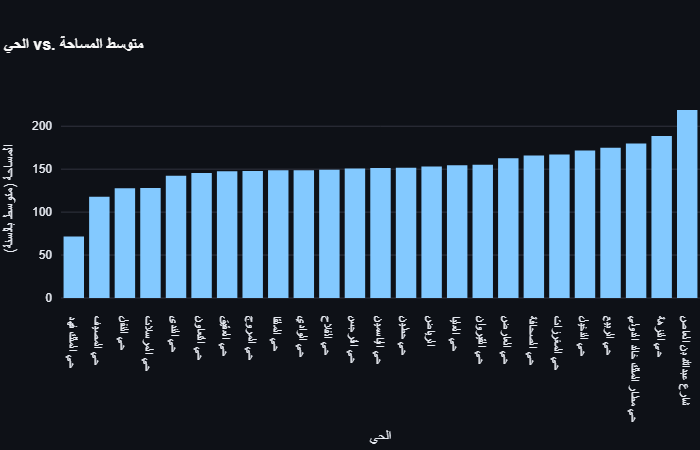
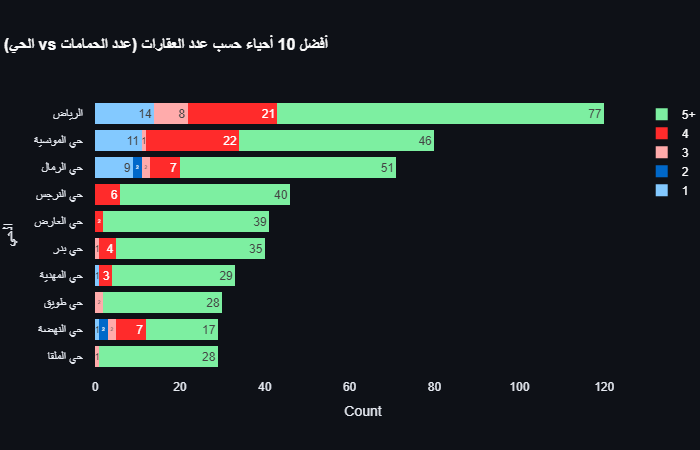
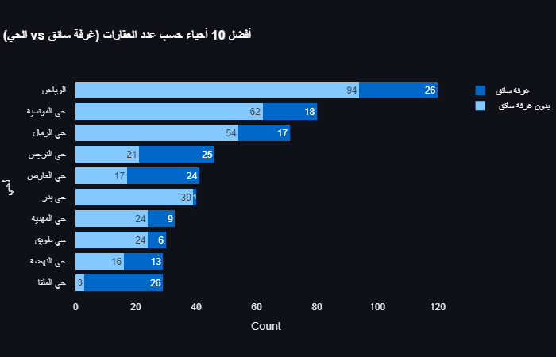

# Use-case-6-Project-3: Silly Belly

[Deployment app](https://reyadgh-6.streamlit.app/)

## Team Members

_Silly Belly (Honorary Member)_

_Riyadh Alghamdi_ @ReyadGH

_Khalid Saeed_ @Khalid-Abood48

_Mohammed Alaklabi_ @MohammedAlaklabi

_Abdullah Altuwayjiri_ @Tw-0l

_Raneem Aljabri_ @Nem7l

## Objectives

1. Pick the most usable dataset.
2. Analyze the available apartments, lands, and villas in Riyadh to uncover insights and trends.
3. Identify the most desirable areas, property types, and features based on the data.
4. Provide recommendations to real estate investors and developers on profitable opportunities in the Riyadh market.

## Problem

The real estate market in Riyadh is rapidly evolving, with new developments and changes in demand. To make informed decisions, real estate professionals and investors need a comprehensive understanding of the current state of the market, including the availability, pricing, and desirable features of properties.

## Questions

1. What is the proportion of purpose to each district in Lands?

2. What is the proportion of purpose to each frontage in Lands?

3. What is the general distribution of land offers across different neighborhoods?

4. What is the mean price for each district in Apartments?

5. What is the mean age for each district in Apartments?

6. What is the mean space for each district in Apartments?

7. What is the proportion of having kitchen to each district in Apartments?

8. What is the proportion of furnished to each district in Apartments?

9. What is the general distribution of Apartments offers across different neighborhoods?

10. How many bathrooms do villas in for each district?

11. What is the proportion of driver room to each district in Villas?

 You can find more Insights in the Streamlit ..

## About the Apartments Dataset

- **Source**: MYFAISAL from Aqaar app (Kaggle)
- **License**: Unknown

The dataset contains details about the available apartments in Riyadh. It includes information such as the number of rooms and bathrooms in each apartment, as well as the specific neighborhoods or areas where these apartments are located.

## Data Profiling and Quality Checks

### Reliability

- **Source**: MYFAISAL from Aqaar app (Kaggle)
- **License**: Unknown
- **Data Timeliness**: the data is up-to-date for our usecase

### Consistency

 is not consistent among other sources 

### Timeliness

 the data is up-to-date for our usecase

### Relevance

 we dropped column 'المدينة' because we don't need it 

### Uniqueness

 we dropped the duplicated rows 

### Completeness

 we filled every null with appropriate value such as 0 for numerical columns, and غير معروف for non-numerical columns
 we replaced number 1 to نعم and 0 to لا or other replacement words in case we needed this step in the future 

### Check Accuracy

 we changed the columns type from float to int for consistency

---

## About the Lands Dataset

- **Source**: MYFAISAL from Aqaar app (Kaggle)
- **License**: Unknown

The dataset contains details about the available Lands in Riyadh. It includes information such as the Total price for each land, as well as the specific neighborhoods or areas where these Lands are located.

## Data Profiling and Quality Checks

### Reliability

- **Source**: MYFAISAL from Aqaar app (Kaggle)
- **License**: Unknown
- **Data Timeliness**: the data is up-to-date for our usecase

### Consistency

 is not consistent among other sources

### Timeliness

 the data is up-to-date for our usecase

### Relevance

 we dropped column 'المدينة' beLcause we don't need it

### Uniqueness

 we dropped the duplicated rows

### Completeness

 we filled غير معروف for non-numerical columns

### Check Accuracy

 we changed the columns type from float to int for consistency

---

## About Riyadh Aqaar Dataset

- **Source**: Kaggle user
- **License**: -
- **Key Concepts**: -

## Data Profiling and Quality Checks

### Reliability

- **Source**: Kaggle user
- **License**: -
- **Data Timeliness**: -

### Consistency

Only one file and Consistent

### Timeliness

up to date for our use case.

### Relevance

The column [المدينة] are not needed in our case.

### Uniqueness

Two villas can be the same for every column (we don't have a unique column).

### Completeness

عرض الشارع: 625
عدد الصالات: 123
عدد الغرف: 97
عدد الحمامات: 97
الواجهة: 31
المساحة: 31

These columns had nulls, and they have been fixed.

### Check Accuracy

All outliers are neutral.

---

## About the RealEstate Dataset 

Data is not usable.

## Data Profiling and Quality Checks

### Reliability

- **Source**: ABDULMALIK M
- **License**: Not specified but the Usability is 7.06
- **Data Timeliness**: Expected update frequency Not specified - Last Updated 2 Years Ago

### Consistency

Only one file.

### Timeliness

The data is up-to-date for our use case.

### Relevance

The data is not usable.

### Uniqueness

The data is not usable.

### Completeness

The data is not usable.

### Check Accuracy

The data is not usable.

---

## About the RealEstate Dataset 

Data is private and can not be used.

## Data Profiling and Quality Checks

### Reliability

- **Source**: Unknown
- **License**: Private data
- **Data Timeliness**: Expected update frequency Not specified - Last Updated 2 Years Ago

### Consistency

Only one file.

### Timeliness

The data is up-to-date for our use case.

### Relevance

The data is not usable.

### Uniqueness

The data is not usable.

### Completeness

The data is not usable.

### Check Accuracy

The data is not usable.
